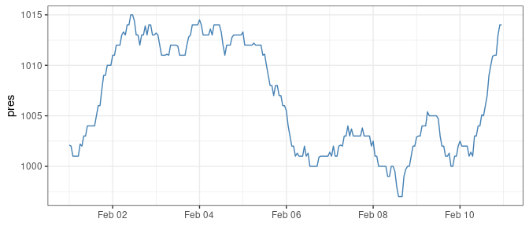

<!-- README.md is generated from README.Rmd. Please edit that file -->

# meteostatR

<!-- badges: start -->

[](https://github.com/jmartindelasierra/meteostatR)
<!-- badges: end -->

This package provides a set of functions to retrieve historical weather
data from [Meteostat](https://meteostat.net), a free online weather and
climate service, by connecting to its JSON API.

I encourage you to visit [Meteostat](https://meteostat.net) and,
especially, the developer’s [site](https://dev.meteostat.net/). Please,
be sure you understand the [terms and
license](https://dev.meteostat.net/docs/terms.html) before continue.

## Installation

You can install this package as follows:

``` r
devtools::install_github("jmartindelasierra/meteostatR")
```

## Preparation

Before using the package, this requires an entry in your `.Renviron`
file to store your Meteostat API key.

You can obtain your key from the Meteostat developer’s
[site](https://dev.meteostat.net/). Once received, edit your `.Renviron`
file with `usethis::edit_r_environ()` by adding the following line:

`METEOSTAT_KEY = your_key`

Remember not to use quotes for your key string.

Next you must restart R to take effect and finally check your key was
recorded:

``` r
Sys.getenv("METEOSTAT_KEY")
```

## Functions

This is the set of functions provided in the package:

  - find\_stations()
    
    Returns weather stations by the indicated string.

  - nearby\_stations()
    
    Returns weather stations nearby the indicated geolocation.

  - metadata\_station()
    
    Returns meta data for the indicated weather station.

  - hourly\_data()
    
    Returns hourly weather data from the indicated weather station.

  - point\_hourly\_data()
    
    Returns hourly weather data from the indicated geolocation by means
    of interpolation.

  - daily\_data()
    
    Returns daily weather data from the indicated station.

  - point\_daily\_data()
    
    Returns daily weather data from the indicated geolocation by means
    of interpolation.

  - climate\_normals()
    
    Returns long-term weather averages from the indicated station.

  - point\_climate\_normals()
    
    Returns long-term weather averages from the indicated geolocation by
    means of interpolation.

Get more about the return values visiting the Meteostat
[API](https://dev.meteostat.net/api/) documentation.

## Example

Let’s show how to use some functions with an example.

We start by attaching the required packages:

``` r
# This package
library(meteostatR)

# Other packages for data manipulation and graphics
library(dplyr)
library(ggplot2)
```

We look for stations located in Barcelona:

``` r
# Find stations including "barcelona"
stations <- find_stations("barcelona")
```

``` r
# Look at the returned data
stations$data
#> # A tibble: 3 x 13
#>   id    name$en country region national   wmo icao  iata  latitude longitude
#>   <chr> <chr>   <chr>   <chr>  <chr>    <int> <chr> <chr>    <dbl>     <dbl>
#> 1 08181 Barcel… ES      CT     <NA>      8181 LEBL  BCN       41.3      2.07
#> 2 80419 Barcel… VE      B      <NA>     80419 SVBC  BLA       10.1    -64.7 
#> 3 08180 Barcel… ES      CT     <NA>      8180 <NA>  <NA>      41.4      2.13
#> # … with 3 more variables: elevation <int>, timezone <chr>, active <lgl>
```

By filtering the stations in Spain, we see that only one is active right
now:

``` r
# Filter by country of interest
stations$data %>%
  filter(country == "ES") %>%
  select(id, name, latitude, longitude, active)
#> # A tibble: 2 x 5
#>   id    name$en                            latitude longitude active
#>   <chr> <chr>                                 <dbl>     <dbl> <lgl> 
#> 1 08181 Barcelona / Aeropuerto                 41.3      2.07 TRUE  
#> 2 08180 Barcelona / Esplugues de Llobregat     41.4      2.13 FALSE
```

We keep such station and retrieve some hourly data:

``` r
# Save station of interest
my_station <- "08181"
```

``` r
# Retrieve hourly data
hourly <- hourly_data(station = my_station, 
                      start = "2021-02-01", 
                      end = "2021-02-10")
```

Let’s see what features we obtained:

``` r
# Variables in data
hourly$data %>% 
  glimpse()
#> Rows: 240
#> Columns: 13
#> $ time       <dttm> 2021-02-01 00:00:00, 2021-02-01 01:00:00, 2021-02-01 02:0…
#> $ time_local <dttm> 2021-02-01 00:00:00, 2021-02-01 01:00:00, 2021-02-01 02:0…
#> $ temp       <dbl> 14.3, 12.0, 15.0, 14.0, 14.0, 13.0, 13.2, 15.0, 16.0, 15.0…
#> $ dwpt       <dbl> 7.8, 9.0, 7.1, 7.1, 6.1, 6.1, 6.1, 4.9, 5.0, 6.0, 6.2, 6.2…
#> $ rhum       <int> 65, 82, 59, 63, 59, 63, 62, 51, 48, 55, 49, 46, 41, 38, 38…
#> $ prcp       <dbl> 0, 0, 0, 0, 0, 0, 0, 0, 0, 0, 0, 0, 0, 0, 0, 0, 0, 0, 0, 0…
#> $ snow       <int> NA, NA, NA, NA, NA, NA, NA, NA, NA, NA, NA, NA, NA, NA, NA…
#> $ wdir       <int> 260, 240, 280, 270, 310, 330, 250, 260, 290, 310, 320, 320…
#> $ wspd       <dbl> 8, 6, 9, 9, 13, 6, 8, 9, 20, 33, 32, 46, 33, 30, 33, 26, 7…
#> $ wpgt       <dbl> 33.3, 35.2, 38.9, 40.8, 44.5, 44.5, 46.3, 48.2, 50.0, 51.8…
#> $ pres       <dbl> 1002.1, 1002.0, 1001.0, 1001.0, 1001.0, 1001.0, 1002.2, 10…
#> $ tsun       <int> NA, NA, NA, NA, NA, NA, NA, NA, NA, NA, NA, NA, NA, NA, NA…
#> $ coco       <int> 2, 7, 2, 2, 2, 2, 3, 2, 2, 2, 1, 2, 1, 2, 2, 2, 2, 2, 1, 1…
```

We may want to plot some data:

``` r
# Plot pressure
hourly$data %>% 
  ggplot(aes(x = time, y = pres)) + 
  geom_line(color = "steelblue") + 
  theme_bw() +
  labs(x = NULL)
```



Now we’re going to retrieve daily data for 2020 and plot the average
temperature:

``` r
# Retrieve daily data
daily <- daily_data(station = my_station, 
                    start = "2020-01-01", 
                    end = "2020-12-31")
```

``` r
# Variables in data
daily$data %>%
    glimpse()
#> Rows: 366
#> Columns: 11
#> $ date <date> 2020-01-01, 2020-01-02, 2020-01-03, 2020-01-04, 2020-01-05, 202…
#> $ tavg <dbl> 7.9, 7.8, 7.1, 7.9, 8.5, 8.3, 8.2, 9.1, 9.5, 9.3, 7.2, 6.4, 7.2,…
#> $ tmin <dbl> 4.9, 4.1, 4.5, 3.9, 4.9, 4.1, 4.6, 4.7, 5.7, 6.8, 4.2, 2.4, 2.9,…
#> $ tmax <dbl> 13.4, 14.7, 11.0, 14.8, 15.1, 16.0, 15.3, 16.7, 14.7, 12.5, 12.3…
#> $ prcp <dbl> 0.0, 0.0, 0.0, 0.0, 0.0, 0.0, 0.0, 0.0, 4.9, 16.2, 0.0, 0.0, 0.0…
#> $ snow <int> NA, NA, NA, NA, NA, NA, NA, NA, NA, NA, NA, NA, NA, NA, NA, NA, …
#> $ wdir <int> 183, 225, 227, 215, 281, 185, 233, 130, 210, 105, NA, 222, NA, 1…
#> $ wspd <dbl> 12.2, 14.7, 17.6, 20.6, 21.3, 14.2, 17.5, 13.2, 14.8, 11.7, 18.6…
#> $ wpgt <dbl> NA, NA, NA, NA, NA, NA, NA, NA, NA, NA, NA, NA, NA, NA, NA, NA, …
#> $ pres <dbl> 1032.1, 1031.8, 1030.9, 1031.4, 1028.6, 1029.4, 1029.8, 1030.2, …
#> $ tsun <int> NA, NA, NA, NA, NA, NA, NA, NA, NA, NA, NA, NA, NA, NA, NA, NA, …
```

``` r
# Plot the average temperature with minimum and maximum ribbon
daily$data %>%
  ggplot(aes(x = date)) + 
  geom_ribbon(aes(ymin = tmin, ymax = tmax), fill = "steelblue", alpha = 0.2) + 
  geom_line(aes(y = tavg), color = "steelblue") + 
  theme_bw() + 
  labs(x = NULL, y = "temp")
```


## Quota

Free access to the Meteostat API is limited to 2,000 requests per day
and no more than two requests per second.

## Attributions

meteostatR: [Jesús Martín de la
Sierra](https://github.com/jmartindelasierra).

Source: [Meteostat](https://meteostat.net). Raw data provided by
[NOAA](https://www.noaa.gov/), [DWD](https://www.dwd.de/) and
[others](https://dev.meteostat.net/docs/sources.html).
